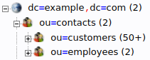

# OpenLDAP example

This example utilizes _OpenLDAP_ as a frontend for _sql2ldap_.
It combines information from _sql2ldap_ and it's local database into one common tree.
Simply run the following command to start the servers:

```sh
sudo docker-compose up -d
```

_OpenLDAP_ is then listening at port `389`.

The mapped PostgreSQL database can be queried and modiefied via http://localhost:8080 with the credentials `sql2ldap`:`masterkey`.
To browse the LDAP directory, visit http://localhost:8081 and simply log in anonymously.


The `ou` `customers` is mapped from _sql2ldap_, the other entries are saved in the local _OpenLDAP_ database.

LDAP queries to the DN `ou=contacts,dc=example,dc=com` will search both, _sql2ldap_ and _OpenLDAP_:

```sh
ldapsearch -x -b "ou=contacts,dc=example,dc=com" -H ldap://localhost:389 "(sn=Me*)" givenName sn
```

```ldif
# extended LDIF
#
# LDAPv3
# base <ou=contacts,dc=example,dc=com> with scope subtree
# filter: (sn=Me*)
# requesting: givenName sn
#

# Gerhard Meyer, employees, contacts, example.com
dn: cn=Gerhard Meyer,ou=employees,ou=contacts,dc=example,dc=com
sn: Meyer
givenName: Gerhard

# 33, customers, contacts, example.com
dn: cn=33,ou=customers,ou=contacts,dc=example,dc=com
givenName: Arif
sn: Merlo

# 40, customers, contacts, example.com
dn: cn=40,ou=customers,ou=contacts,dc=example,dc=com
givenName: Weiyi
sn: Meriste

# search result
search: 2
result: 0 Success

# numResponses: 4
# numEntries: 3
```
